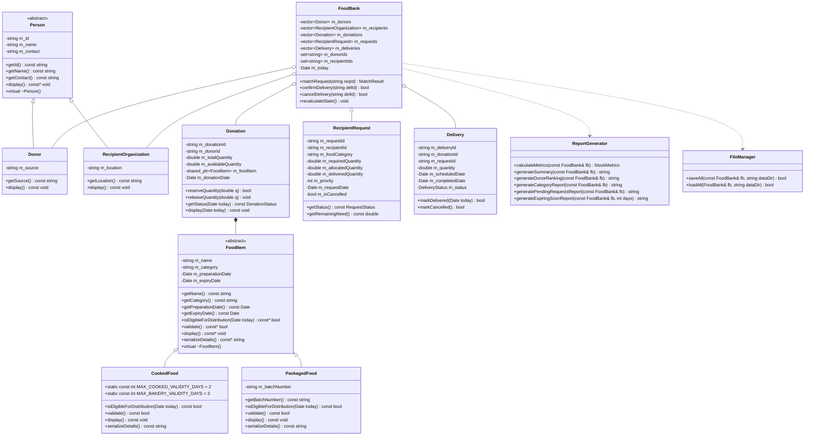

# Food Donation and Redistribution Management System
> A console-driven C++ Object-Oriented Programming mini project built for academic submission, evaluation, and viva defense.

[](LICENSE)
[](AGENTS.md)
[](https://github.com/SnehalPrince/Food-Donation-and-Redistribution-Management-System/actions/workflows/ci.yml)
[](https://sdgs.un.org/goals/goal2)
[](https://sdgs.un.org/goals/goal12)
[](DISTRIBUTION.md)

---

## 1. Project Purpose & UN SDG Alignment

Food surplus from cafeterias, restaurants, grocery stores, and households frequently goes to waste while community shelters face recurring food shortages. This system bridges that gap by systematically tracking food supply batches, prioritizing recipient requirements, matching donations in earliest-expiry order, and recording physical deliveries.

### United Nations Sustainable Development Goals (SDG) Alignment

This project directly aligns with two United Nations Sustainable Development Goals:

1. **SDG 2: Zero Hunger — Target 2.1**
   - *Target:* "By 2030, end hunger and ensure access by all people, in particular the poor and people in vulnerable situations, including infants, to safe, nutritious and sufficient food all year round."
   - *System Feature:* Priority-based request queueing (`1 = High`, `2 = Medium`, `3 = Low`) and automated delivery tracking directly redistribute edible surplus to shelters and community kitchens.
   - *Report Line:*  
     `[SDG 2: Zero Hunger - Target 2.1]`  
     `* Food Provided to People in Need: XX.XX kg`  
     `* Completed Food Relief Missions:  XX`  
     `* Recipient Organizations Served:  XX`

2. **SDG 12: Responsible Consumption and Production — Target 12.3**
   - *Target:* "By 2030, halve per capita global food waste at the retail and consumer levels and reduce food losses along production and supply chains, including post-harvest losses."
   - *System Feature:* Earliest-Expiry-First allocation algorithm and expiring-soon inventory alerts divert edible surplus from landfills while tracking food spoilage loss.
   - *Report Line:*  
     `[SDG 12: Responsible Consumption - Target 12.3]`  
     `* Surplus Diverted from Landfill:  XX.XX kg`  
     `* Surplus Lost to Spoilage/Expiry: XX.XX kg`

---

## 2. Key Features

- **Strict Encapsulation & Pure OOP:** Zero global variables; all attributes are `private` with validated accessors.
- **Two-Phase Redistribution:** Matching reserves stock (`SCHEDULED` delivery); delivery confirmation finalizes transfer (`DELIVERED`) or cancellation restores reserved inventory (`CANCELLED`).
- **Mathematical Stock Reconciliation:** Real-time assertion that:
  $$\text{Total Donated} = \text{Redistributed} + \text{In-Transit} + \text{Available In Stock} + \text{Wasted (Expired)}$$
  Within double precision $\epsilon = 10^{-9}$. Displays `Stock reconciliation: OK`.
- **Earliest-Expiry-First Allocation:** Prioritizes perishable items closest to expiration, preventing waste.
- **Multi-Batch Allocation:** Single requests can draw across multiple donation lots if needed.
- **Priority Queue Processing:** `std::queue` orders pending recipient requests by urgency (`1 = High` to `3 = Low`).
- **Robust Text File Persistence:** Zero external dependencies (STL only). Data is saved in pipe-delimited (`|`) format across `donors.txt`, `recipients.txt`, `donations.txt`, `requests.txt`, and `deliveries.txt`. Auto-loads on startup; handles missing files and skips malformed records with line-numbered diagnostics.
- **Fail-Safe Console Input:** Whole-line reading via `InputHelper`, numerical bounds enforcement, invalid calendar date rejection (`2026-02-30`), string sanitation (rejects `|`), and safe EOF handling.

---

## 3. Class Architecture (Mermaid Diagram)



---

## 4. How to Build and Run

### Prerequisites
- Any C++ compiler supporting C++11 or C++17 (`g++`, `clang++`, or MSVC).
- Zero external libraries required (pure C++ Standard Library).

### Build on Windows (Command Prompt / PowerShell)
```powershell
# Using the bundled make wrapper (delegates to mingw32-make)
make all

# Run the application
.\build\foodbank.exe

# Or using the PowerShell script
.\build.ps1 -Target all -Std c++11
```

### Build on Linux / macOS
```bash
# Build binary
make all

# Run
./build/foodbank
```

### Verification & Testing Commands
```bash
# Run full automated test suite (all modules + E2E + robustness)
make test

# Verify zero compiler warnings under both C++11 and C++17
make check-std

# Run the official Plan.md Viva Demo Scenario
make demo
```

### IDE Setup (Code::Blocks / Dev-C++ / Visual Studio)
1. Open your IDE and create a **New Empty C++ Console Project**.
2. Add all `.h` and `.cpp` files in the workspace root to the project:
   - `Date.h`, `Date.cpp`
   - `InputHelper.h`, `InputHelper.cpp`
   - `Person.h`, `Person.cpp`
   - `Donor.h`, `Donor.cpp`
   - `Recipient.h`, `Recipient.cpp`
   - `FoodItem.h`, `FoodItem.cpp`
   - `CookedFood.h`, `CookedFood.cpp`
   - `PackagedFood.h`, `PackagedFood.cpp`
   - `Donation.h`, `Donation.cpp`
   - `RecipientRequest.h`, `RecipientRequest.cpp`
   - `Delivery.h`, `Delivery.cpp`
   - `FoodBank.h`, `FoodBank.cpp`
   - `ReportGenerator.h`, `ReportGenerator.cpp`
   - `FileManager.h`, `FileManager.cpp`
   - `main.cpp`
3. Ensure compiler settings are set to `-std=c++11` or `-std=c++17`.
4. Click **Build and Run**.

---

## 5. Command-Line Arguments

The application accepts optional CLI flags for deterministic test runs and customized storage:
```text
--today YYYY-MM-DD    Sets the simulation calendar date (default: system clock)
--data-dir <path>     Directory path for reading/writing persistent text files (default: data)
```
**Example:**
```bash
./build/foodbank --today 2026-10-05 --data-dir my_custom_data
```

---

## 6. Menu Structure

```text
=============================================
   FOOD DONATION & REDISTRIBUTION SYSTEM     
=============================================
1. Register Donor
2. Register Recipient
3. Add Food Donation
4. View Donations
5. Add Recipient Requirement
6. View Pending Requests (Sub-menu: View / Cancel)
7. Match Donation (Sub-menu: Next in Queue / Chosen by ID / Auto-Match All)
8. Record Delivery (Sub-menu: Confirm DELIVERED / Mark CANCELLED)
9. Search Records (Sub-menu: Search by ID, Donor, Category, Name, Status)
10. Show Expiring Donations (Configurable threshold in days)
11. Generate Summary Report (Sub-menu: Summary & SDG / Donor Ranking / Category / Queue / Expiry)
12. Save Data
13. Exit
```

---

## 7. Data File Format (Pipe-Separated Text)

All records are stored as single lines separated by pipes (`|`):

- **`donors.txt`**: `id|name|contact|source`  
  *Example:* `D001|MAIT Canteen|canteen@mait.edu|Canteen`
- **`recipients.txt`**: `id|name|contact|location`  
  *Example:* `R001|Community Shelter|shelter@community.org|Sector 14`
- **`donations.txt`**: `donationId|donorId|name|category|totalQuantity|prepDate|expiryDate|extraDetails|donationDate`  
  *Example:* `DON101|D001|Cooked Meals|COOKED|50.00|2026-10-05|2026-10-07|-|2026-10-05`
- **`requests.txt`**: `requestId|recipientId|category|requiredQuantity|priority|requestDate|cancelled`  
  *Example:* `REQ101|R001|COOKED|30.00|1|2026-10-05|0`
- **`deliveries.txt`**: `deliveryId|donationId|requestId|quantity|scheduledDate|status|completedDate`  
  *Example:* `DEL001|DON101|REQ101|30.00|2026-10-05|DELIVERED|2026-10-05`

---

## 8. Sample Session Output (Real Run)

Captured from `make demo` with input redirected from `tests/demo_input.txt`:

```text
====================================================
Food Donation & Redistribution Management System
Today: 2026-10-05 | Data Directory: tests/temp_demo_data
Loaded: 0 donors, 0 recipients, 0 donations, 0 requests, 0 deliveries.
====================================================

--- Register Donor ---
Success: Donor D001 registered successfully.

--- Add Food Donation ---
Success: Donation DON101 registered (50 kg of Cooked Meals).

--- Register Recipient Organization ---
Success: Recipient Organization R001 registered successfully.

--- Add Recipient Requirement ---
Success: Request REQ101 registered successfully.

--- Match Donation ---
Result: Allocated 30 kg across 1 delivery record(s). Balance pending: 0 kg.

--- Record Delivery ---
Success: Delivery DEL001 confirmed as DELIVERED.

====================================================
       FOOD REDISTRIBUTION SYSTEM SUMMARY REPORT    
====================================================
System Date: 2026-10-05

--- INVENTORY & STOCK RECONCILIATION ---
Total Food Donated:             50.00 kg
Total Food Redistributed:       30.00 kg
Food In-Transit (Reserved):      0.00 kg
Available In Stock:             20.00 kg
Expired / Wasted Food:           0.00 kg
Net Remaining (Unredeemed):     20.00 kg
Stock reconciliation: OK

--- OPERATIONS & FULFILLMENT ---
Total Recipient Requests:           1
Fulfilled Requests:                 1
Pending / Partial Requests:         0
Fulfillment Rate:             100.00 %
Total Completed Deliveries:         1

--- SUSTAINABLE DEVELOPMENT GOALS (SDG) IMPACT ---
[SDG 2: Zero Hunger - Target 2.1]
  * Food Provided to People in Need: 30.00 kg
  * Completed Food Relief Missions:  1
  * Recipient Organizations Served:  1
[SDG 12: Responsible Consumption - Target 12.3]
  * Surplus Diverted from Landfill:  30.00 kg
  * Surplus Lost to Spoilage/Expiry: 0.00 kg
====================================================
```

---

## 9. Known Limitations

1. **Console ASCII UI:** No graphical user interface; console layout is plain ASCII to maintain 100% compatibility across all legacy college lab terminals.
2. **Single-User Architecture:** Designed as an in-memory single-process command-line tool; does not support concurrent multi-threaded writes or distributed network access.
3. **AddressSanitizer on Windows MinGW:** MinGW-w64 on Windows does not bundle static `libasan`/`libubsan` runtimes. (Clean sanitization is available when compiling under Linux GCC / Clang).

---

## 10. Repository Resources & Governance

| Document | Purpose |
| -------- | ------- |
| [LICENSE](LICENSE) | MIT Open Source License |
| [CODE_OF_CONDUCT.md](CODE_OF_CONDUCT.md) | Contributor Covenant v2.1 Standards |
| [CONTRIBUTING.md](CONTRIBUTING.md) | Contribution guide, coding standards, and pull request procedures |
| [DISTRIBUTION.md](DISTRIBUTION.md) | Binary distribution, portable layout, and examiner evaluation packaging |
| [SECURITY.md](SECURITY.md) | Security scope and vulnerability reporting instructions |
| [CHANGELOG.md](CHANGELOG.md) | Version history and milestone release logs |
| [SUPPORT.md](SUPPORT.md) | Support contacts and academic defense inquiries |
| [docs/VIVA_NOTES.md](docs/VIVA_NOTES.md) | 22 anticipated viva exam questions and detailed answers |
| [docs/DECISIONS.md](docs/DECISIONS.md) | Architectural decision records (D1 through D10) |
| [docs/TEST_REPORT.md](docs/TEST_REPORT.md) | Complete test suite execution matrix and verification evidence |
| [docs/REVIEW.md](docs/REVIEW.md) | Independent code review against specifications |

---

## Maintainer

- **Snehal Prince** — [@SnehalPrince](https://github.com/SnehalPrince)
